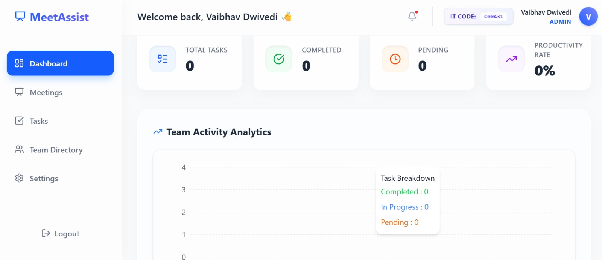
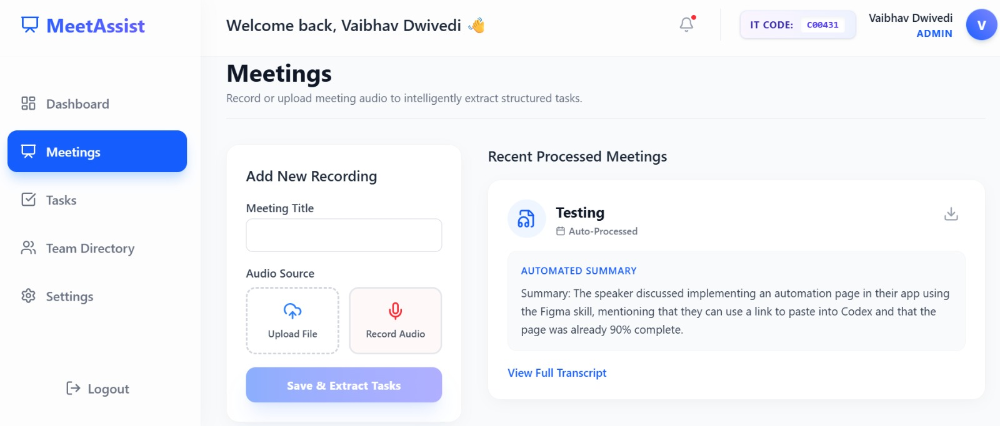
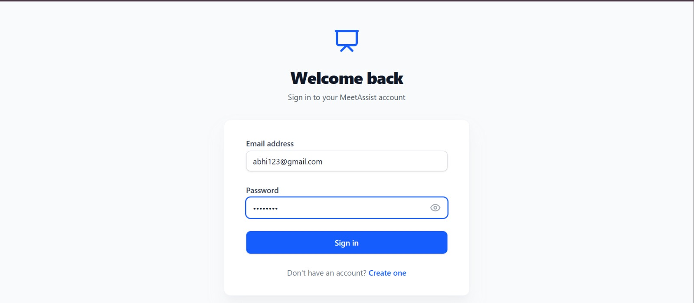
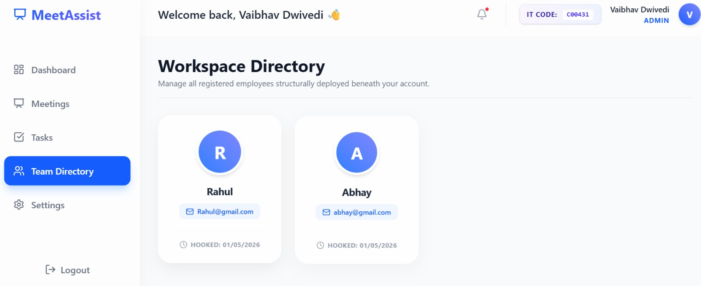
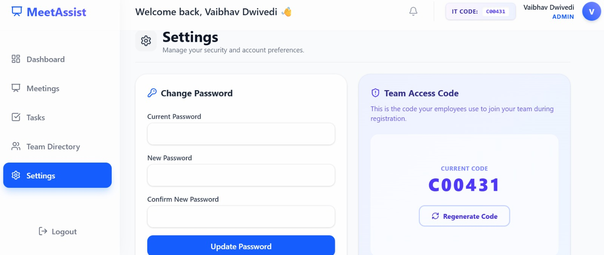

# MeetAssist 🎙️✨

## 🎥 Demo Video

▶️ https://your-video-link.com

---

**MeetAssist** is an enterprise-grade AI Meeting and Task Assistant. It intelligently records or processes meeting audio, automatically generates summaries, and extracts actionable tasks. Built with a robust Role-Based Access Control (RBAC) system, it enables structural managers to oversee employees, delegate tasks, and maintain seamless team workflows.

🚀 Key Features

Intelligent Audio Processing: Upload audio files or record meetings live directly from the browser with support for microphone + system audio mixing and real-time waveform visualization.

AI-Powered Summaries & Tasks: Leverages Whisper and LLaMA/OpenAI models to generate meeting transcripts, concise summaries, and automatically extract actionable tasks and deadlines.

Role-Based Access Control (RBAC):
Admin/Manager: Supervise employees, view team analytics, generate secure Team Access Codes, and manage global team tasks.
Employee: Join teams via Team Codes, view personal and delegated tasks, and manage personal profile settings.

Interactive Task Board: A dynamic Kanban-style board to track tasks (Pending, In Progress, Completed) with drag-and-drop functionality.

Smart Task Assignment: Automatically assigns tasks using AI-based name matching from meeting conversations.

Team Delegation: Assign tasks directly to team members and set detailed deadlines.

Export Capabilities: Download tasks as .ics calendar events or export full meeting reports as beautifully formatted PDFs.

Real-Time Notifications: Instant alerts when tasks are assigned or updated.

Modern Security: Secure JWT authentication, encrypted password hashing (BCrypt), and robust route protection.

## 🛠️ Tech Stack

### Frontend

* **Framework:** React 19 + Vite
* **Styling:** Tailwind CSS v4
* **Icons & Notifications:** Lucide React, React Hot Toast
* **HTTP Client:** Axios

### Backend

* **Framework:** Spring Boot 3.4
* **Language:** Java 17
* **Security:** Spring Security & JWT (JSON Web Tokens)
* **Database:** MySQL with Spring Data JPA
* **AI Integration:** OpenAI API

---

## 💻 Local Setup Instructions

### Prerequisites

* Node.js (v18+)
* Java JDK 17
* MySQL Server running locally
* An OpenAI API Key

### 1. Database Setup

1. Create a MySQL database named `meeting_assistant`.
2. The application will automatically create and update the necessary tables on startup.

### 2. Backend Setup

1. Navigate to the backend directory:

   ```bash
   cd backend
   ```
2. Create or configure your `src/main/resources/application.properties` with your MySQL credentials and OpenAI API Key:

   ```properties
   server.port=8081
   spring.datasource.url=jdbc:mysql://localhost:3306/meeting_assistant?createDatabaseIfNotExist=true
   spring.datasource.username=root
   spring.datasource.password=your_password

   jwt.secret=your_super_secret_key_here
   openai.api.key=sk-your_openai_api_key
   ```
3. Run the Spring Boot application:

   ```bash
   # Windows
   .\gradlew bootRun

   # Mac/Linux
   ./gradlew bootRun
   ```

### 3. Frontend Setup

1. Navigate to the frontend directory:

   ```bash
   cd frontend
   ```
2. Install the dependencies:

   ```bash
   npm install
   ```
3. Ensure the API URL in `src/services/api.js` matches your backend port (e.g., `http://localhost:8081/api`).
4. Start the development server:

   ```bash
   npm run dev
   ```

## 🔐 Team Onboarding Flow

1. **Manager Registration:** A user registers as an **Admin/Manager**.
2. **Code Generation:** The Manager navigates to **Settings** to find or regenerate their unique 6-character **Team Access Code**.
3. **Employee Registration:** A new user registers as an **Employee** and inputs the Manager's Team Code. They are instantly linked to the Manager's dashboard for task delegation.

---

## 📸 Screenshots

### 📊 Dashboard (Task Board)

<p align="center">
  
</p>

### 🤖 AI Meeting Processing

<p align="center">
  
</p>

### 🔐 Authentication (Login)

<p align="center">
  
</p>

### 👥 Team Directory

<p align="center">
  
</p>

### ⚙️ Settings & Access Control

<p align="center">
  
</p>

---

## 👨‍💻 Author

Vaibhav Dwivedi
